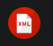

# Lenguaje de marcas UD1

## Deficiones de lenguaje de marcas

### Definición

Lenguaje de marcas: Organiza información mediante una sintaxis basada en marcas o etiquetas.

### Tipo de lenguajes de marcas

|Tipo|Para qué sirve|Ejemplos|
|----|--------------|--------|
|Presentación|Muestra contenido formateado|*HTML, CSS*|
|Descriptivo| Intercambio inforamción| *XML, JSON*|
|Documentación| Documentar proyectos| *Markdown, LaTex*|

## Instalación y configuración del entorno de trabajo

1. Instalar [VS Code](https://code.visualstudio.com/)
2. Instalar plugins
   - [HTML CSS Suport](https://marketplace.visualstudio.com/items?itemName=ecmel.vscode-html-css)
   - [Live Preview](https://marketplace.visualstudio.com/items?itemName=ms-vscode.live-server)
   - [Markdown All in One](https://marketplace.visualstudio.com/items?itemName=yzhang.markdown-all-in-one)
   - [XML - Red Hat](https://marketplace.visualstudio.com/items?itemName=redhat.vscode-xml)
3. Instalar git 
```bash
sudo apt install git
```
  
## Plugins Instalados en VS Code
|Plugins|Para que sirven|Imágenes|
|-------|---------------|--------|
|**HTML CSS Suport**| Ayuda con sintaxis y autocompletado en HTML y CSS| 
|**Live Preview**| Permite revisar el estado de tu pagina en HTML| 
|**Markdown All in One**| Visualizar presentación en Markdown | 
|**XML - Red Hat**| Soporte para el lenguaje XML y su autocompleatdo|

